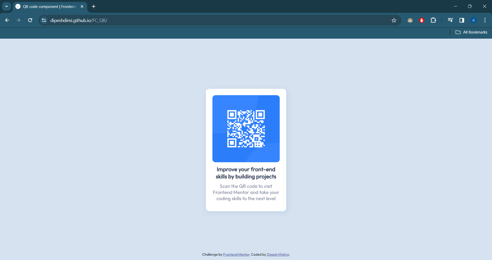

# Frontend Mentor - QR code component solution

This is a solution to the [QR code component challenge on Frontend Mentor](https://www.frontendmentor.io/challenges/qr-code-component-iux_sIO_H).

## Table of contents

- [Screenshot](#screenshot)
- [Links](#links)
- [Built with](#built-with)
- [Author](#author)

### Screenshot

### Links

- Solution URL: https://github.com/dipeshdimi/FC_QR
- Live Site URL: https://dipeshdimi.github.io/FC_QR/

### Built with

- Semantic HTML5 markup
- CSS custom properties
- Flexbox

## Author

- Frontend Mentor - [@dipeshdimi](https://www.frontendmentor.io/profile/dipeshdimi)
- Github - [@dipeshdimi](https://github.com/dipeshdimi)